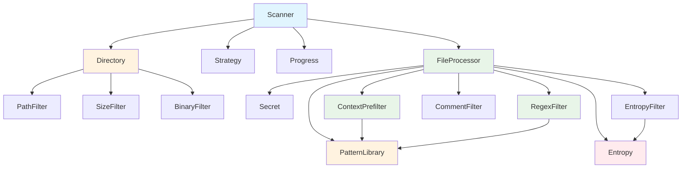

# Plan: Clean Architecture Design for Optimized Scanner

## 🎯 Overview

This document outlines the corrected architecture design for the scan2 implementation, addressing the hybrid architecture issues identified in the current implementation. The design focuses on proper object-oriented principles with clear separation of concerns and optimal memory management.

## 🚨 Problem Statement

The current scan module implementation suffers from:
- **Hybrid Architecture**: Mix of clean patterns and legacy approaches
- **Broken Dependencies**: Objects created at wrong levels 
- **Memory Inefficiency**: Redundant object creation
- **Unclear Responsibilities**: Objects used where they shouldn't be

## 🏗️ Corrected Architecture Design

### **Object Dependency Analysis**



### **Three-Tier Architecture**

#### **Tier 1: Scanner Level (Coordination)**
Objects needed throughout the entire scan lifecycle:

```rust
pub struct Scanner {
    config: ScannerConfig,
    
    // COORDINATION objects (used throughout entire scan)
    directory: Directory,           // ✅ Phase 1: Directory traversal
    strategy: Strategy,            // ✅ Execution planning & coordination
    progress: Progress,            // ✅ Visual feedback throughout scan
    
    // DIRECTORY FILTERS (used during traversal phase)
    path_filter: PathFilter,       // ✅ Path ignore patterns
    size_filter: SizeFilter,       // ✅ File size limits  
    binary_filter: BinaryFilter,   // ✅ Binary file detection
}
```

#### **Tier 2: FileProcessor Level (Per-Worker)**
Objects needed for content processing (created once per worker thread):

```rust
pub struct FileProcessor {
    config: ScannerConfig,
    
    // SHARED DATA (zero-copy references)
    pattern_library: Arc<PatternLibrary>,  // ✅ Shared pattern data
    entropy_analyzer: Entropy,             // ✅ Statistical analysis algorithms
    secret_factory: Secret,                // ✅ SecretMatch creation logic
    
    // CONTENT PROCESSING PIPELINE (separate responsibilities)
    context_prefilter: ContextPrefilter,   // ✅ Aho-Corasick keyword prefiltering
    regex_filter: RegexFilter,             // ✅ Regex pattern execution
    comment_filter: CommentFilter,         // ✅ guardy:allow directive filtering
    entropy_filter: EntropyFilter,         // ✅ Statistical entropy validation
}
```

#### **Tier 3: Static Optimizations (Global Shared)**
Expensive data structures shared across all instances:

```rust
// Pattern library data (shared via Arc<LazyLock>)
static SHARED_PATTERN_LIBRARY: LazyLock<Arc<PatternLibrary>> = LazyLock::new(|| {
    // Built once, shared by all FileProcessors via Arc
});

// Aho-Corasick automaton (shared via Arc<LazyLock>)
static SHARED_KEYWORD_AUTOMATON: LazyLock<Arc<aho_corasick::AhoCorasick>> = LazyLock::new(|| {
    // Built once from pattern library, shared by all ContextPrefilters
});

// Binary extensions (shared via Arc<LazyLock>)
static SHARED_BINARY_EXTENSIONS: LazyLock<Arc<HashSet<String>>> = LazyLock::new(|| {
    // Built once, shared by all BinaryFilters
});
```

## **📋 Content Processing Pipeline**

### **Execution Flow Overview**

```text
FileProcessor.process_file(content)
    ↓
1. ContextPrefilter: content → Vec<usize> (active pattern indices)
    ↓
2. RegexFilter: content + indices → Vec<PotentialMatch>
    ↓
3. For each PotentialMatch:
    ├── CommentFilter: check guardy:allow → keep/discard
    └── EntropyFilter: validate entropy → keep/discard
    ↓
4. Secret: create SecretMatch objects → Vec<SecretMatch>
```

### **Pipeline Execution Order & Rationale**

#### **1. ContextPrefilter First (Keyword Prefiltering)**
- **Input**: Raw file content string
- **Process**: Aho-Corasick keyword detection in O(n) time  
- **Output**: `Vec<usize>` - indices of patterns that have keywords present
- **Purpose**: Eliminate ~85% of patterns before expensive regex operations

#### **2. RegexFilter Second (Pattern Matching)**
- **Input**: File content + active pattern indices
- **Process**: Execute `regex.find_iter()` only on patterns with keywords
- **Output**: `Vec<PotentialMatch>` - all regex matches from active patterns
- **Purpose**: Find actual secret candidates using precise regex patterns

#### **3. CommentFilter Third (Directive Filtering)**  
- **Input**: Individual `PotentialMatch` objects
- **Process**: Check if match line contains "guardy:allow" directive
- **Output**: Filtered `PotentialMatch` (keep/discard decision)
- **Purpose**: Respect inline ignore directives for false positives

#### **4. EntropyFilter Fourth (Statistical Validation)**
- **Input**: Individual `PotentialMatch` objects  
- **Process**: Calculate entropy score and validate against threshold
- **Output**: Validated `PotentialMatch` (keep/discard decision)  
- **Purpose**: Filter out low-entropy false positives (test data, examples)

### **Why This Order?**

1. **ContextPrefilter → RegexFilter**: Must prefilter before regex execution (performance optimization)
2. **RegexFilter → CommentFilter**: Need matches before checking ignore directives  
3. **CommentFilter → EntropyFilter**: Check simple directives before expensive entropy calculation
4. **Batch Processing**: Steps 1-2 process entire file, steps 3-4 process individual matches

## 📋 Detailed Object Responsibilities

### **Scanner (Orchestrator)**
```rust
impl Scanner {
    /// Create scanner with coordination objects only
    pub fn new(config: ScannerConfig) -> Result<Self> {
        Ok(Self {
            config: config.clone(),
            
            // Coordination objects (needed throughout scan)
            directory: Directory::new(&config)?,
            strategy: Strategy::new(&config)?,
            progress: Progress::new(&config)?,
            
            // Directory filters (needed during traversal)
            path_filter: PathFilter::new(&config)?,
            size_filter: SizeFilter::new(&config)?, 
            binary_filter: BinaryFilter::new(&config)?,
        })
    }
    
    /// Main scan entry point - coordinates phases
    pub fn scan(&self, paths: &[String]) -> Result<ScanResult> {
        let start_time = Instant::now();
        
        // PHASE 1: Directory Analysis (uses Scanner objects)
        let filtered_files = self.directory.collect_filtered_files(
            paths,
            &self.path_filter,    // Injected filter
            &self.size_filter,    // Injected filter
            &self.binary_filter,  // Injected filter
        )?;
        
        // PHASE 2: Content Processing (creates FileProcessors)
        let results = match self.strategy.execution_mode(filtered_files.len())? {
            ExecutionMode::Sequential => self.scan_sequential(filtered_files)?,
            ExecutionMode::Parallel { workers } => self.scan_parallel(filtered_files, workers)?,
        };
        
        Ok(results)
    }
    
    /// Parallel execution with per-worker FileProcessors
    fn scan_parallel(&self, files: Vec<PathBuf>, workers: usize) -> Result<ScanResult> {
        self.strategy.execute_parallel(workers, files, |file_batch| {
            // Create ONE FileProcessor per worker (not per file!)
            let file_processor = FileProcessor::new(&self.config)?;
            
            // Process entire batch with this worker's FileProcessor
            file_batch.into_iter()
                .map(|file| file_processor.process_file(&file))
                .collect::<Result<Vec<_>>>()
        })
    }
}
```

### **Directory (File Discovery + Directory Filtering)**
```rust
impl Directory {
    /// Collect files and apply directory-level filtering
    pub fn collect_filtered_files(
        &self,
        paths: &[String],
        path_filter: &PathFilter,      // Injected dependency
        size_filter: &SizeFilter,      // Injected dependency
        binary_filter: &BinaryFilter,  // Injected dependency
    ) -> Result<Vec<PathBuf>> {
        // Step 1: File discovery using ignore::WalkBuilder
        let all_files = self.walk_directories(paths)?;
        
        // Step 2: Apply directory filters
        let mut filtered_files = Vec::new();
        for file_path in all_files {
            let metadata = std::fs::metadata(&file_path)?;
            let candidate = FileCandidate { path: &file_path, metadata: &metadata };
            
            // Apply injected filters
            if path_filter.should_filter(&candidate)?.filtered { continue; }
            if size_filter.should_filter(&candidate)?.filtered { continue; }
            if binary_filter.should_filter(&candidate)?.filtered { continue; }
            
            filtered_files.push(file_path);
        }
        
        Ok(filtered_files)
    }
}
```

### **FileProcessor (Content Processing Pipeline Orchestrator)**
```rust
impl FileProcessor {
    /// Create FileProcessor with separated processing components
    pub fn new(config: &ScannerConfig) -> Result<Self> {
        // Get shared pattern library (zero-copy Arc reference)
        let pattern_library = SHARED_PATTERN_LIBRARY.clone();
        
        // Create analysis objects
        let entropy_analyzer = Entropy::new(config)?;
        let secret_factory = Secret::new(config)?;
        
        // Create processing pipeline components (using shared data)
        let context_prefilter = ContextPrefilter::new(config, &pattern_library)?;
        let regex_filter = RegexFilter::new(config, &pattern_library)?;
        let comment_filter = CommentFilter::new(config)?;
        let entropy_filter = EntropyFilter::new(config, &entropy_analyzer)?;
        
        Ok(Self {
            config: config.clone(),
            pattern_library,
            entropy_analyzer,
            secret_factory,
            context_prefilter,
            regex_filter,
            comment_filter,
            entropy_filter,
        })
    }
    
    /// Process single file through the complete content pipeline
    pub fn process_file(&self, file_path: &Path) -> Result<FileProcessingResult> {
        let mut file_stats = FileStats::default();
        
        // Step 1: Load file content
        let content = std::fs::read_to_string(file_path)
            .with_context(|| format!("Failed to read file: {}", file_path.display()))?;
        
        // Step 2: Context prefiltering (Aho-Corasick keyword detection)
        let active_pattern_indices = self.context_prefilter.get_active_patterns(&content);
        file_stats.patterns_prefiltered = self.pattern_library.total_patterns() - active_pattern_indices.len();
        
        if active_pattern_indices.is_empty() {
            // No patterns have keywords in this file - early exit
            return Ok(FileProcessingResult::empty(file_path));
        }
        
        // Step 3: Regex pattern execution (only on patterns with keywords)
        let potential_matches = self.regex_filter.find_matches(&content, &active_pattern_indices)?;
        file_stats.potential_matches = potential_matches.len();
        
        // Step 4: Apply content filters to each potential match
        let mut final_secrets = Vec::new();
        for potential_match in potential_matches {
            // Comment filter: Check for guardy:allow directives
            if self.comment_filter.should_filter(&potential_match)?.filtered {
                file_stats.matches_filtered_by_comment += 1;
                continue;
            }
            
            // Entropy filter: Validate statistical entropy
            if self.entropy_filter.should_filter(&potential_match)?.filtered {
                file_stats.matches_filtered_by_entropy += 1;
                continue;
            }
            
            // Match passed all filters - create final secret
            let secret = self.secret_factory.create_match(potential_match, file_path)?;
            final_secrets.push(secret);
        }
        
        file_stats.secrets_found = final_secrets.len();
        
        Ok(FileProcessingResult {
            file_path: file_path.to_string(),
            secrets: final_secrets,
            file_stats,
            success: true,
            error: None,
        })
    }
}
```

### **PatternLibrary (Shared Data Container)**
```rust
/// PatternLibrary - Pure data storage for secret detection patterns
pub struct PatternLibrary {
    patterns: Vec<SecretPattern>,
    total_keywords: usize,
}

impl PatternLibrary {
    pub fn new() -> Result<Self> {
        // Load patterns from YAML (embedded + custom)
        let patterns = Self::load_all_patterns()?;
        let total_keywords = patterns.iter().map(|p| p.keywords.len()).sum();
        
        Ok(Self { patterns, total_keywords })
    }
    
    pub fn get_pattern(&self, index: usize) -> Option<&SecretPattern> {
        self.patterns.get(index)
    }
    
    pub fn total_patterns(&self) -> usize {
        self.patterns.len()
    }
    
    pub fn extract_all_keywords(&self) -> Vec<String> {
        self.patterns.iter()
            .flat_map(|p| p.keywords.iter())
            .cloned()
            .collect()
    }
}
```

### **ContextPrefilter (Keyword Prefiltering)**
```rust
/// ContextPrefilter - Aho-Corasick keyword-based pattern prefiltering
pub struct ContextPrefilter {
    automaton: Arc<aho_corasick::AhoCorasick>,      // Shared automaton
    keyword_to_patterns: HashMap<String, Vec<usize>>, // Keyword → pattern indices
    pattern_count: usize,
}

impl ContextPrefilter {
    pub fn new(config: &ScannerConfig, pattern_library: &Arc<PatternLibrary>) -> Result<Self> {
        // Use shared Aho-Corasick automaton
        let automaton = SHARED_KEYWORD_AUTOMATON.clone();
        
        // Build keyword mapping for this instance
        let keyword_to_patterns = Self::build_keyword_mapping(pattern_library)?;
        
        Ok(Self {
            automaton,
            keyword_to_patterns,
            pattern_count: pattern_library.total_patterns(),
        })
    }
    
    /// Get pattern indices that have keywords in the content
    pub fn get_active_patterns(&self, content: &str) -> Vec<usize> {
        let mut active_indices = HashSet::new();
        
        // Single Aho-Corasick pass over content
        for keyword_match in self.automaton.find_iter(content) {
            let keyword = keyword_match.pattern();
            if let Some(pattern_indices) = self.keyword_to_patterns.get(keyword) {
                active_indices.extend(pattern_indices);
            }
        }
        
        active_indices.into_iter().collect()
    }
}
```

### **RegexFilter (Pattern Execution)**
```rust
/// RegexFilter - Regex pattern execution on prefiltered patterns
pub struct RegexFilter {
    pattern_library: Arc<PatternLibrary>,  // Shared pattern data
}

impl RegexFilter {
    pub fn new(config: &ScannerConfig, pattern_library: &Arc<PatternLibrary>) -> Result<Self> {
        Ok(Self {
            pattern_library: pattern_library.clone(),
        })
    }
    
    /// Execute regex patterns on content for specified pattern indices
    pub fn find_matches(
        &self,
        content: &str,
        active_pattern_indices: &[usize],
    ) -> Result<Vec<PotentialMatch>> {
        let mut matches = Vec::new();
        
        // Execute only the active patterns (those with keywords present)
        for &pattern_index in active_pattern_indices {
            if let Some(pattern) = self.pattern_library.get_pattern(pattern_index) {
                // Execute regex pattern on entire content
                for regex_match in pattern.regex.find_iter(content) {
                    let line_info = self.get_line_info(content, regex_match.start())?;
                    
                    matches.push(PotentialMatch {
                        file_path: String::new(), // Set by FileProcessor
                        line_number: line_info.line_number,
                        line_content: line_info.line_content.to_string(),
                        matched_text: regex_match.as_str().to_string(),
                        pattern_name: pattern.name.clone(),
                        start_pos: regex_match.start(),
                        end_pos: regex_match.end(),
                    });
                }
            }
        }
        
        Ok(matches)
    }
}
```

## 🔧 Unified Filter Interface

### **Filter Trait**
```rust
/// Unified filter interface for consistent behavior
pub trait Filter<T> {
    /// Create filter instance (called once per worker/scanner)
    fn new(config: &ScannerConfig) -> Result<Self> where Self: Sized;
    
    /// Apply filter to input (returns true if item should be excluded)
    fn should_filter(&self, input: &T) -> Result<FilterResult>;
    
    /// Filter name for debugging
    fn name(&self) -> &'static str;
}

/// Result from filter operation
#[derive(Debug)]
pub struct FilterResult {
    pub filtered: bool,           // Should exclude this item?
    pub reason: Option<String>,   // Why filtered (for debugging)
    pub metadata: FilterMetadata, // Processing metrics
}

#[derive(Debug, Default)]
pub struct FilterMetadata {
    pub processing_time_ns: u64,
    pub bytes_processed: usize,
}
```

### **Filter Input Types**
```rust
/// Directory-level filter input
pub struct FileCandidate<'a> {
    pub path: &'a Path,
    pub metadata: &'a std::fs::Metadata,
}

/// Content-level filter input
pub struct PotentialMatch<'a> {
    pub file_path: &'a Path,
    pub content: &'a str,
    pub line_number: usize,
    pub line_content: &'a str,
    pub matched_text: &'a str,
    pub pattern_name: &'a str,
}
```

### **Filter Implementations**
```rust
// Directory filters
impl Filter<FileCandidate<'_>> for PathFilter {
    fn should_filter(&self, candidate: &FileCandidate) -> Result<FilterResult> {
        // Use shared GlobSet via Arc<LazyLock>
        let filtered = SHARED_IGNORE_PATTERNS.is_match(candidate.path);
        Ok(FilterResult { filtered, reason: None, metadata: Default::default() })
    }
}

impl Filter<FileCandidate<'_>> for BinaryFilter {
    fn should_filter(&self, candidate: &FileCandidate) -> Result<FilterResult> {
        // Use shared binary extensions via Arc<LazyLock>
        let extension = candidate.path.extension()
            .and_then(|ext| ext.to_str())
            .unwrap_or("");
        
        let filtered = SHARED_BINARY_EXTENSIONS.contains(extension);
        Ok(FilterResult { filtered, reason: None, metadata: Default::default() })
    }
}

// Content filters
impl Filter<PotentialMatch<'_>> for ContextPrefilter {
    fn should_filter(&self, potential_match: &PotentialMatch) -> Result<FilterResult> {
        // Use shared Aho-Corasick automaton via Arc<LazyLock>
        let has_keywords = SHARED_KEYWORD_AUTOMATON
            .find(potential_match.matched_text)
            .is_some();
        
        let filtered = !has_keywords; // Filter out if no keywords found
        Ok(FilterResult { filtered, reason: None, metadata: Default::default() })
    }
}

impl Filter<PotentialMatch<'_>> for EntropyFilter {
    fn should_filter(&self, potential_match: &PotentialMatch) -> Result<FilterResult> {
        // Use injected entropy analyzer
        let entropy_score = self.entropy_analyzer.calculate_entropy(potential_match.matched_text)?;
        let filtered = entropy_score < self.config.min_entropy_threshold;
        
        Ok(FilterResult { 
            filtered, 
            reason: if filtered { Some(format!("Low entropy: {:.6}", entropy_score)) } else { None },
            metadata: Default::default()
        })
    }
}
```

## 📊 Statistics Architecture

### **Dual-Level Statistics**
```rust
/// Per-file statistics (fresh for each file)
#[derive(Debug, Default)]
pub struct FileStats {
    pub potential_matches: usize,
    pub matches_filtered_by_context: usize,
    pub matches_filtered_by_comment: usize,
    pub matches_filtered_by_entropy: usize,
    pub secrets_found: usize,
    pub processing_time_ms: u64,
}

/// Overall scan statistics (accumulated across all files)
#[derive(Debug, Default)]
pub struct OverallStats {
    // Directory phase
    pub files_discovered: usize,
    pub files_filtered_by_path: usize,
    pub files_filtered_by_size: usize,
    pub files_filtered_by_binary: usize,
    pub files_processed: usize,
    pub files_with_errors: usize,
    
    // Content phase
    pub total_potential_matches: usize,
    pub total_matches_filtered_by_context: usize,
    pub total_matches_filtered_by_comment: usize,
    pub total_matches_filtered_by_entropy: usize,
    pub total_secrets_found: usize,
    
    // Performance
    pub scan_duration_ms: u64,
    pub directory_traversal_ms: u64,
    pub content_processing_ms: u64,
}
```

### **Statistics Collection Flow**
```rust
impl Scanner {
    pub fn scan(&self, paths: &[String]) -> Result<ScanResult> {
        let mut overall_stats = OverallStats::default();
        let start_time = Instant::now();
        
        // Phase 1: Directory traversal updates overall_stats
        let filtered_files = self.directory.collect_filtered_files_with_stats(
            paths, &mut overall_stats
        )?;
        
        // Phase 2: Content processing accumulates file_stats into overall_stats
        let mut all_secrets = Vec::new();
        for file_path in filtered_files {
            let file_result = file_processor.process_file(&file_path)?;
            
            // Accumulate file statistics into overall statistics
            overall_stats.total_potential_matches += file_result.file_stats.potential_matches;
            overall_stats.total_matches_filtered_by_context += file_result.file_stats.matches_filtered_by_context;
            overall_stats.total_matches_filtered_by_comment += file_result.file_stats.matches_filtered_by_comment;
            overall_stats.total_matches_filtered_by_entropy += file_result.file_stats.matches_filtered_by_entropy;
            overall_stats.total_secrets_found += file_result.secrets.len();
            
            all_secrets.extend(file_result.secrets);
        }
        
        overall_stats.scan_duration_ms = start_time.elapsed().as_millis() as u64;
        
        Ok(ScanResult {
            matches: all_secrets,
            stats: overall_stats.into(), // Convert to legacy ScanStats format
            warnings: vec![],
        })
    }
}
```

## 💾 Memory Efficiency Strategy

### **Creation Frequency Table**
| Object | Creation Level | Instances | Memory Impact | Justification |
|--------|---------------|-----------|---------------|---------------|
| **Scanner** | Main | 1× | Minimal | Coordination only |
| **Directory, Strategy, Progress** | Scanner | 1× each | Low | Used throughout scan |
| **Directory Filters** | Scanner | 1× each | Low | Used during traversal |
| **FileProcessor** | Per Worker | N× (workers) | Moderate | Heavy processing objects |
| **Content Filters** | Per Worker | N× (workers) | Moderate | Need processing dependencies |
| **Static Data** | Global | 1× (shared) | High (but shared) | `Arc<LazyLock>` zero-copy |

### **Performance Benefits**
1. **Pattern Object**: Created N×workers (not N×files) - ~1000× memory savings
2. **Static Optimizations**: All `Arc<LazyLock>` patterns preserved for zero-copy sharing
3. **Filter Reuse**: Each worker reuses filters across all its files
4. **Optimal Parallelization**: Heavy objects created once per worker thread

## 🚀 Implementation Benefits

### **Architecture Advantages**
1. **Clear Separation**: Objects created where and when actually needed
2. **Optimal Memory**: Heavy objects created minimally (per-worker, not per-file)
3. **Static Optimizations Preserved**: All existing `Arc<LazyLock>` patterns maintained
4. **Thread Safety**: Stateless filters safe for concurrent use
5. **Dependency Injection**: Clean object relationships with proper dependencies

### **Performance Characteristics**
- **Directory Phase**: Fast file filtering with minimal object overhead
- **Content Phase**: Heavy processing objects created optimally (once per worker)
- **Filter Efficiency**: Stateless filters with zero-copy static data sharing
- **Memory Usage**: Linear with worker count, not file count

### **Maintainability**
- **Single Responsibility**: Each object has one clear purpose
- **Clear Dependencies**: Explicit injection of required dependencies
- **Testable**: Easy to mock dependencies and test individual components
- **Extensible**: New filters/objects can be added without changing existing code

## 🎯 Next Steps

### **Implementation Priority**
1. **Define unified Filter trait and input types**
2. **Implement FileProcessor with proper dependency injection**
3. **Update Directory to use injected filters**
4. **Fix existing filter implementations to use instance methods**
5. **Update core Scanner to use corrected architecture**
6. **Add comprehensive statistics collection**
7. **Test compilation and performance**

### **Success Criteria**
- ✅ **Objects created at correct levels** - Scanner/Worker/Global as appropriate
- ✅ **Zero redundant creation** - Heavy objects created minimally
- ✅ **Static optimizations preserved** - All `Arc<LazyLock>` patterns maintained
- ✅ **Clean compilation** - No broken function calls or type mismatches
- ✅ **Performance target met** - 5× improvement through optimal architecture

## 🔄 **Architecture Update Summary**

### **Key Changes Made**

#### **1. Separated Content Processing Pipeline**

**Before (Problematic):**
```rust
ContextPrefilter // Did BOTH keyword prefiltering AND coordinated regex execution
```

**After (Clean Separation):**
```rust
ContextPrefilter  // ONLY Aho-Corasick keyword prefiltering → Vec<usize>
    ↓
RegexFilter      // ONLY regex pattern execution → Vec<PotentialMatch>
    ↓
CommentFilter    // ONLY guardy:allow directive filtering 
    ↓
EntropyFilter    // ONLY statistical entropy validation
```

#### **2. Shared PatternLibrary Architecture**

**New Shared Data Pattern:**
- **PatternLibrary**: Pure data container (patterns, keywords, regex)
- **ContextPrefilter**: Uses PatternLibrary for keyword extraction
- **RegexFilter**: Uses PatternLibrary for pattern execution
- **Zero Data Duplication**: Single source of truth for all pattern data

#### **3. Clear Pipeline Orchestration**

**FileProcessor manages the complete pipeline:**
1. **ContextPrefilter** eliminates ~85% of patterns via keyword detection
2. **RegexFilter** executes remaining patterns to find matches
3. **CommentFilter** & **EntropyFilter** validate individual matches
4. **Secret** factory creates final SecretMatch objects

### **Benefits Achieved**

✅ **Clean Separation of Concerns**: Each component has single responsibility  
✅ **Shared Data Efficiency**: PatternLibrary shared via Arc<LazyLock>  
✅ **Pipeline Flexibility**: Easy to modify individual stages independently  
✅ **Testability**: Can unit test each component in isolation  
✅ **Performance Optimization**: Clear boundaries for optimization  
✅ **Memory Efficiency**: Zero redundant pattern data storage  

## 📋 **Agreed Implementation Tasks**

#### **Task 1: Change Pattern → PatternLibrary**
**File: `src/scan/pattern.rs`**
- [ ] Rename `Pattern` struct to `PatternLibrary` 
- [ ] Remove individual pattern execution methods (`find_all_matches()`)
- [ ] Keep pattern loading and shared data functionality

#### **Task 2: Update ContextFilter** 
**File: `src/scan/filters/content/context.rs`**
- [ ] Update to use `PatternLibrary` instead of `Pattern`
- [ ] Ensure ONLY does Aho-Corasick keyword prefiltering
- [ ] Returns `Vec<usize>` pattern indices only

#### **Task 3: Create RegexFilter**
**New File: `src/scan/filters/content/regex.rs`**
- [ ] Create new `RegexFilter` struct  
- [ ] Move pattern execution logic from old Pattern class
- [ ] Takes content + active indices, returns `Vec<PotentialMatch>`

#### **Task 4: Update FileProcessor**
**File: `src/scan/file.rs`**
- [ ] Update to use new pipeline: ContextFilter → RegexFilter → CommentFilter → EntropyFilter
- [ ] Create both ContextFilter and RegexFilter instances
- [ ] Coordinate the pipeline execution

---

**Document Status**: Core tasks defined and ready for implementation  
**Date**: 2025-08-12  
**Next Action**: Begin implementation of agreed tasks