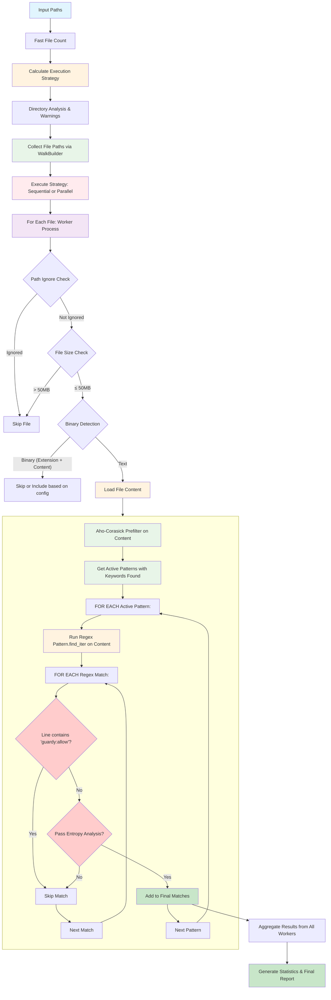

# Plan: Optimized Scanner Implementation (scan2)

## 🔄 Working Method

**Critical Implementation Protocol:**
1. **Explain First**: Always explain exactly what will be implemented before starting any work
2. **Get Approval**: Wait for user approval before proceeding with implementation  
3. **Test Yourself**: After implementing, test the functionality yourself thoroughly
4. **User Testing Instructions**: Provide clear instructions for user to test the implementation
5. **Continue After Approval**: Only move to the next step after receiving user approval
6. **Update Plan**: Keep this plan document updated with progress throughout implementation

This ensures quality, transparency, and user confidence throughout the development process.

## 📋 Overview

This plan outlines the implementation of a next-generation scanner (`scan2`) based on Aho-Corasick + keyword prefiltering strategy, inspired by Gitleaks' proven approach. The goal is to achieve **~5x performance improvement** while maintaining comprehensive pattern coverage.

## 🎯 Goals

1. **Performance**: ~5x faster than current scanner through Aho-Corasick prefiltering
2. **Coverage**: Match or exceed current pattern detection capabilities  
3. **Modularity**: Clean, well-structured, maintainable codebase
4. **Compatibility**: Seamless integration with existing config and CLI
5. **Validation**: Comprehensive testing and benchmarking vs current implementation

## 🏗️ Architecture Overview

### Complete Scanning Algorithm (From Current Scanner Analysis)

Based on analysis of the existing scanner, here's the complete scanning algorithm we need to implement:



### Detailed Algorithm Steps

#### **Phase 1: Setup & Strategy Determination**
1. **Input Processing**: Parse input paths (files/directories)
2. **Fast File Count**: Lightweight directory traversal to count files
3. **Strategy Calculation**: 
   - Calculate max workers based on CPU cores & thread percentage
   - Apply domain-specific adaptation based on file count
   - Choose Sequential/Parallel based on mode & file count threshold
4. **Directory Analysis**: Analyze directory structure, suggest .gitignore improvements

#### **Phase 2: File Collection**  
5. **WalkBuilder Setup**: Configure ignore::WalkBuilder with:
   - `.gitignore` respect (git_ignore, git_global, git_exclude)
   - Symlink following based on config
   - Directory filtering (node_modules, target, etc.)
6. **Collect File Paths**: Walk directory tree and collect all candidate file paths

#### **Phase 3: Parallel Execution**
7. **Worker Allocation**: Distribute file paths across available workers
8. **Progress Tracking**: Set up enhanced progress reporting (sequential ⏳ vs parallel ⚡)

#### **Phase 4: Per-File Processing Pipeline**
For each file (executed by worker):

9. **Path-Level Filtering**:
   - Path ignore check (GlobSet matching against config.ignore_paths)
   - File size check (against config.max_file_size_mb)
   - Binary detection (extension check → content inspection)

10. **Content Loading**: Load full file content (whole file, not streaming)

11. **Pattern Matching Pipeline** (THE KEY OPTIMIZATION):
    ```
    a) Aho-Corasick Prefilter:
       - Run keyword automaton against entire file content
       - Get list of patterns whose keywords are present
       - Skip ~85% of patterns that have no matching keywords
    
    b) FOR EACH active pattern (with keywords found):
       - Run regex pattern.find_iter() on full content
       
       c) FOR EACH regex match found:
          - Get line containing match
          - Check if line contains 'guardy:allow' → Skip if yes
          - Apply entropy analysis → Skip if low entropy
          - Create SecretMatch with precise location info
          - Add to final matches list
    ```

12. **Result Collection**: Return all matches that passed all filters

#### **Phase 5: Result Aggregation & Progress Management**
13. **Aggregate Results**: Combine results from all workers
14. **Generate Statistics**: Files scanned/skipped, duration, match counts
15. **Create Final Report**: ScanResult with matches, stats, and warnings

### Visual Progress & Logging Integration

#### **Progress Reporting System** (Using existing `parallel::progress` module):

**Sequential Mode** (⏳):
```
🔍 [00:01:23] ████████████████████████░░░░  1,234/1,500 files ⠈ 📊 Scanned: 1,200 | With Secrets: 15 | Skipped: 34 | Binary: 89
```

**Parallel Mode** (⚡):
```
[Worker 01] ████████████████████████░░░░   312/400 📄 ...src/main.rs
[Worker 02] ███████████████████████████░   375/400 📄 ...lib/config.rs  
[Worker 03] ████████████████████████████   400/400 📄 ...tests/unit.rs
[Worker 04] ████████████████████████░░░░   298/400 📄 ...docs/api.md

Overall:
[00:01:45] ████████████████████████░░░░  1,385/1,600 files (86%)
📊 Scanned: 1,301 | With Secrets: 23 | Skipped: 84 | Binary: 121
```

#### **Progress Integration Points**:

1. **Strategy Selection Display**:
   ```rust
   match execution_strategy {
       ExecutionStrategy::Sequential => output::styled!("🔍 Scanning {} files...", file_count),
       ExecutionStrategy::Parallel { workers } => output::styled!("⚡ Scanning {} files using {} workers...", file_count, workers),
   }
   ```

2. **Per-Worker Updates** (Parallel mode):
   ```rust
   // In worker closure
   progress.update_worker_file(worker_id, &file_path.to_string_lossy());
   
   // Statistics updates
   stats.increment_scanned(); // After successful scan
   stats.increment_with_secrets(); // If matches found
   stats.increment_skipped(); // On errors
   stats.increment_binary(); // For binary files
   ```

3. **Progress Updates** (Two-tier system):
   ```rust
   // Progress bar position: Every 5 files (responsive but not too frequent)
   if current % 5 == 0 || current == total {
       progress.update_overall(current, total);
   }
   
   // Statistics message: Every 100 files (reduce visual spam)
   if completed % 100 == 0 || completed == total {
       // Update "📊 Scanned: X | With Secrets: Y | Skipped: Z | Binary: W"
   }
   
   // Current file display: Every file (real-time feedback)
   progress.update_worker_file(worker_id, &file_path);
   ```

#### **Logging Levels** (Using existing CLI verbose system):

**Level 0 (Default)**:
- Only show results and errors
- Progress bars active
- No debug information

**Level 1 (`-v`)**:
- Show pattern information: `📋 GitHub Token - GitHub Personal Access Token`
- Show file-level information for found secrets
- Show warning summaries

**Level 2 (`-vv`)**:
- Debug-level logging enabled
- Show detailed configuration
- Show detailed directory analysis
- Show per-pattern statistics

**Level 3+ (`-vvv`)**:
- Trace-level logging 
- Show all internal operations
- Show globset/ignore operations

**Quiet Mode (`-q`)**:
- Suppress all progress bars
- Only show final results and errors
- No visual feedback during processing

#### **Integration with New Scanner**:

```rust
// In src/scan/core.rs
impl Scanner {
    pub fn scan_with_progress(&self, paths: &[String], verbose_level: u8, quiet: bool) -> Result<ScanResult> {
        // Step 1: Setup progress reporting based on strategy and quiet mode
        let progress = if quiet {
            None
        } else {
            match execution_strategy {
                ExecutionStrategy::Sequential => Some(factories::enhanced_sequential_reporter(file_count)),
                ExecutionStrategy::Parallel { workers } => Some(factories::enhanced_parallel_reporter(file_count, workers)),
            }
        };

        // Step 2: Execute with progress integration
        // Step 3: Handle verbose-level outputs
        if verbose_level > 0 {
            // Show pattern information, file details, etc.
        }
    }
}
```

**🔴 CRITICAL: Entropy Analysis Integration**
- **Step J**: After pattern matching, apply entropy analysis to validate randomness
- **Multi-metric validation**: Distinct values, character distribution, bigram frequency  
- **Configurable thresholds**: Default 1.0/1e5, with 10x requirement for non-numeric strings
- **Performance**: Memoized calculations, precompiled regex patterns
- **Preserved exactly**: All 488 bigram patterns, probability calculations unchanged

### Module Structure
```
src/
├── cli/commands/           # CLI integration (following existing patterns)
│   ├── scan.rs            # Existing scan command
│   ├── scan2.rs           # NEW - Development scan2 command
│   └── ...                # Other existing commands
├── scanner/               # Legacy scanner (preserve until migration complete)
│   ├── mod.rs            # Existing scanner interface  
│   ├── core.rs           # Current scanner implementation
│   └── ...               # All existing scanner modules
├── scan/                 # New scanner architecture (clean, no marketing terms)
│   ├── mod.rs            # Public API exports
│   ├── types.rs          # Core data structures and configuration
│   ├── core.rs           # Main scanner with complete mermaid diagram flow implementation
│   ├── patterns/         # Pattern management
│   │   ├── mod.rs        # Pattern library management and public API
│   │   └── loader.rs     # Pattern definitions (~40 Guardy + ~30 selected patterns)
│   ├── file_filters/     # Type 1: File-level filtering (pre-content)
│   │   ├── mod.rs        # File filter chain orchestration
│   │   ├── path.rs       # Path ignore checking
│   │   ├── size.rs       # File size checking (50MB limit)
│   │   └── binary.rs     # Binary file detection (extension + content)
│   ├── content_filters/  # Type 2: Pattern-level filtering (post-content)
│   │   ├── mod.rs        # Content filter chain orchestration
│   │   ├── prefilter.rs  # Aho-Corasick keyword filtering
│   │   ├── ignore.rs     # Inline 'guardy:allow' comment filtering
│   │   └── entropy.rs    # Entropy analysis filtering (exact copy from legacy)
│   └── processing/       # Core processing (non-filtering)
│       ├── mod.rs        # Processing orchestration
│       ├── content.rs    # File content loading
│       └── matching.rs   # Regex pattern matching engine
└── [all existing modules] # Keep all existing: config/, git/, hooks/, parallel/, etc.
```

### CLI Integration Strategy
- **Phase 1**: Build `guardy scan2` subcommand with clean, modern architecture
- **Phase 2**: After validation, replace `guardy scan` with the new implementation
- **Phase 3**: Remove legacy `scanner/` module entirely

## 🔍 Critical Legacy Functionality Analysis

### **Must-Preserve Components from Existing Scanner**

#### 1. **Advanced Entropy Analysis** (entropy.rs)
- **Multi-metric Statistical Analysis**: Combines distinct values, character class distribution, and bigram frequency analysis
- **Base Detection**: Hex (16), alphanumeric (36), full base64 (64) with probability calculations
- **Performance**: Memoization with `memoize` crate, precompiled regex patterns
- **Tuning**: Configurable thresholds (default: 1.0/1e5), numbers requirement heuristics
- **🚨 CRITICAL**: Extensively tested with real-world data, must preserve exact logic

#### 1.1. **Enhanced File Size Configuration**
- **Default Maximum File Size**: 50MB
- **Override Capability**: `--max-file-size-mb` flag allows per-scan customization
- **Modern Development**: Accommodates larger bundle files, generated code, and data files

#### 2. **Comprehensive Pattern Library** (patterns.rs)
- **40+ Production-Ready Patterns**: Private keys, cloud credentials, API tokens, AI services
- **Modern Coverage**: 2024-2025 AI services (Claude, OpenAI, Hugging Face, Cohere, etc.)
- **Capture Groups**: Support for extracting specific secret content from matches
- **Custom Pattern Support**: Error handling for user-defined regex patterns from config
- **🚨 CRITICAL**: Each pattern represents extensive real-world testing

#### 3. **Clean Ignore System**
- **Path-based**: GlobSet patterns for entire files/directories  
- **Pattern-based**: Line content patterns (DEMO_KEY_, FAKE_, etc.)
- **Inline directives**: Single `guardy:allow` directive like Gitleaks
- **🚨 CRITICAL**: Simple, efficient ignore system optimized for performance

#### 4. **Two-Stage Binary File Detection** (binary.rs)
- **Stage 1 - Extension Check**: O(1) HashSet lookup of 168 known binary extensions
  - Instant rejection of `.exe`, `.jpg`, `.zip`, `.dll`, `.so`, `.dylib`, etc.
  - No file I/O needed - just filename check
- **Stage 2 - Content Inspection**: Only for unknown extensions
  - Uses `content_inspector` crate (reads first 512 bytes)
  - Detects binary content even without extension (e.g., renamed files)
- **Performance Impact**: ~95% of binary files caught by extension check alone
- **🚨 CRITICAL**: This two-stage approach prevents unnecessary I/O and regex processing

#### 6. **Configuration System Integration** (core.rs)
- **SuperConfig Integration**: YAML/TOML/JSON support with complex merging
- **CLI Override Support**: Command-line arguments override config file values
- **Environment Variables**: Runtime configuration override support
- **Debug Tracing**: Comprehensive logging for configuration troubleshooting
- **🚨 CRITICAL**: Complex config merging logic handles edge cases

#### 7. **File Processing Engine** (core.rs)
- **Streaming Support**: Large files (>5MB) handled without loading fully into memory
- **Error Recovery**: Graceful handling of permission errors, unreadable files
- **UTF-8 Handling**: Robust text processing with fallback strategies
- **Performance**: OS cache optimization (2.7x speedup on warm caches)
- **🚨 CRITICAL**: Production-tested with 100k+ file repositories

#### 8. **Parallel Integration** (directory.rs)
- **Resource Calculation**: CPU core detection, thread percentage application  
- **Performance-First Approach**: Maximum worker utilization regardless of file count
- **Progress Reporting**: Worker-specific progress with strategy icons (⏳ sequential, ⚡ parallel)
- **🚨 CRITICAL**: Tight integration with existing parallel execution framework

## 📊 Technical Implementation Plan

### Phase 1: End-to-End Minimal Scanner (Day 1)

**Goal**: Get a working scan2 command that follows the diagram flow exactly, then optimize iteratively.

**Naming Strategy**:
- **Development**: Use "scan2" internally for testing and validation
- **Final Product**: Completely replace existing scanner - users just use `guardy scan`
- **No Marketing Terms**: Avoid "optimized" or other hype words in user-facing parts

#### Task 1.1: Foundation with Type Compatibility ✅ COMPLETED
- **File**: `src/scan/types.rs`, `src/scan/mod.rs`
- **Status**: ✅ **COMPLETED** - Foundation created with exact type compatibility
- **Purpose**: Exact copy of existing type system to ensure compatibility

#### Task 1.2A: Core Implementation with Complete Flow
- **File**: `src/scan/core.rs`
- **Purpose**: Complete scanner implementation with mermaid diagram flow (no separate pipeline module)
- **Implementation**:
  ```rust
  pub struct Scanner {
      patterns: PatternManager,
      file_filters: FileFilterChain,
      content_filters: ContentFilterChain,
      config: ScannerConfig,
  }
  
  impl Scanner {
      pub fn new(config: ScannerConfig) -> Result<Self> { /* ... */ }
      
      pub fn scan_file(&self, path: &Path) -> Result<Vec<SecretMatch>> {
          // Direct implementation of mermaid diagram flow:
          // 1. File-level filtering (path ignore → size check → binary detection)
          // 2. Content processing (load content → pattern matching) 
          // 3. Content filtering (guardy:allow → entropy analysis)
          // 4. Collect final matches
      }
      
      pub fn scan_paths(&self, paths: &[String]) -> Result<Vec<SecretMatch>> { /* ... */ }
  }
  ```

#### Task 1.2B: CLI Integration (scan2 Development Command)
- **File**: `src/cli/commands/scan2.rs`  
- **Purpose**: Add `guardy scan2` subcommand following existing CLI patterns
- **Integration**: Update `src/cli/commands/mod.rs` to include scan2 subcommand
- **Implementation**:
  ```rust
  #[derive(clap::Args)]
  pub struct Scan2Args {
      #[arg(required = true)]
      pub paths: Vec<String>,
      
      #[arg(long, default_value = "50")]
      pub max_file_size_mb: usize,
      
      #[arg(long)]
      pub no_entropy: bool,
  }
  ```

#### Task 1.2C: Supporting Filter Modules
- **Files**: `src/scan/file_filters/`, `src/scan/content_filters/`, `src/scan/processing/`
- **Purpose**: Implement modular components used by core scanner
- **Components**:
  - **File Filters**: Path ignore, size check, binary detection (called by core.rs)
  - **Content Filters**: 'guardy:allow' filtering, entropy analysis (called by core.rs)
  - **Content Processing**: File loading, pattern matching (called by core.rs)

#### Task 1.3: Pattern Loading (Minimal)
- **File**: `src/scan/patterns/mod.rs`, `src/scan/patterns/loader.rs`
- **Purpose**: Load existing Guardy patterns without classification/optimization  
- **Implementation**: Simple pattern loading (~40 Guardy patterns initially)
- **Future**: Add selected patterns from other sources (~30 additional)

#### Task 1.4: End-to-End Testing
- **Purpose**: Test complete workflow and validate against existing scanner
- **Commands**: 
  - `guardy scan2 src/` (new implementation)
  - `guardy scan src/` (existing implementation)  
- **Validation**: Compare results for accuracy and performance

#### Task 1.5: Directory Orchestration with Performance-First Parallel Processing
- **File**: `src/scan/directory.rs`
- **Purpose**: High-level directory walking and scan orchestration with optimized parallel execution  
- **Source**: Extract from `src/scanner/directory.rs` (DirectoryHandler + orchestration logic)
- **Worker Allocation Strategy**:
  ```rust
  use crate::parallel::{ExecutionStrategy, progress::factories};
  
  pub struct ScanOrchestrator {
      binary_detector: BinaryDetector,
      file_processor: FileProcessor,  
      ignore_system: IgnoreSystem,
  }
  
  impl ScanOrchestrator {
      pub fn scan_directory(&self, path: &Path, strategy: ExecutionStrategy) -> Result<ScanResult>
      pub fn collect_file_paths(&self, path: &Path) -> Result<Vec<PathBuf>>
      
      /// Performance-first worker allocation - use maximum available workers
      pub fn determine_optimal_workers(&self, _file_count: usize, max_workers: usize) -> usize {
          max_workers  // Always use maximum available workers for best performance
      }
      
      pub fn determine_execution_strategy(&self, file_count: usize, config: &ScannerConfig) -> ExecutionStrategy {
          match config.scan_mode {
              ScanMode::Sequential => ExecutionStrategy::Sequential,
              ScanMode::Parallel => {
                  let max_workers = ExecutionStrategy::calculate_optimal_workers(
                      config.max_threads,     // User override (0 = no limit)
                      config.thread_percentage // % of CPU cores (default 75%)
                  );
                  ExecutionStrategy::Parallel { workers: max_workers }
              },
              ScanMode::Auto => {
                  let max_workers = ExecutionStrategy::calculate_optimal_workers(
                      config.max_threads, 
                      config.thread_percentage
                  );
                  ExecutionStrategy::auto(
                      file_count,
                      config.min_files_for_parallel, // Default: 5 files
                      max_workers                     // Use all available workers
                  )
              }
          }
      }
  }
  ```

#### Task 1.6: Ignore System
- **File**: `src/scan/ignore.rs`
- **Purpose**: Two-tier ignore system: file/path ignores and inline comment ignores
- **Source**: Extract ignore logic from existing modules
- **Implementation**:
  ```rust
  pub struct IgnoreSystem {
      path_ignorer: GlobSet,           // File/directory path ignores (*.log, tests/**, etc.)
      pattern_ignorer: Vec<String>,    // Content pattern ignores (DEMO_KEY_, FAKE_, etc.)
  }
  
  impl IgnoreSystem {
      pub fn should_ignore_path(&self, path: &Path) -> bool    // File-level ignores
      pub fn should_ignore_by_pattern(&self, content: &str) -> bool  // Pattern-level ignores
      // Note: Inline `guardy:allow` comments handled in post-processing step during pattern matching
  }
  ```

### Phase 2: Core Pattern System (Day 2)

#### Task 2.1: Aho-Corasick Keyword Prefilter
- **File**: `src/scan/prefilter.rs`
- **Purpose**: Ultra-fast keyword filtering to eliminate 85% of content
- **Strategy**: Extract keywords from all patterns to build Aho-Corasick automaton
- **Implementation**:
  ```rust
  use aho_corasick::{AhoCorasick, AhoCorasickBuilder, MatchKind};
  
  pub struct KeywordPrefilter {
      automaton: AhoCorasick,
      keyword_to_patterns: HashMap<String, Vec<usize>>, // keyword -> pattern indices
  }
  
  impl KeywordPrefilter {
      pub fn new(patterns: &[ClassifiedPattern]) -> Result<Self> {
          let keywords: Vec<String> = patterns
              .iter()
              .enumerate()
              .flat_map(|(idx, pattern)| {
                  pattern.keywords.iter().map(move |kw| (kw.clone(), idx))
              })
              .collect();
              
          let automaton = AhoCorasickBuilder::new()
              .match_kind(MatchKind::LeftmostFirst)
              .build(&keywords.iter().map(|(kw, _)| kw).collect::<Vec<_>>())?;
              
          Ok(Self { automaton, keyword_to_patterns })
      }
      
      pub fn prefilter_content(&self, content: &str) -> HashSet<usize> {
          // Returns set of pattern indices that have keywords present
          let mut active_patterns = HashSet::new();
          for mat in self.automaton.find_iter(content) {
              if let Some(pattern_indices) = self.keyword_to_patterns.get(&content[mat.range()]) {
                  active_patterns.extend(pattern_indices);
              }
          }
          active_patterns
      }
  }
  ```

#### Task 2.2: Pattern Classification System
- **File**: `src/scan/patterns/classification.rs`
- **Purpose**: Intelligent pattern categorization for optimal performance
- **Strategy**: Classify patterns based on performance characteristics
- **Categories**:
  ```rust
  #[derive(Debug, Clone)]
  pub enum PatternClass {
      Specific,    // High-specificity patterns with reliable keywords (e.g., "sk_live_")
      Contextual,  // Patterns needing context analysis (e.g., generic API keys)
      AlwaysRun,   // Patterns without reliable keywords (e.g., entropy-only)
  }
  
  pub struct ClassifiedPattern {
      pub pattern: SecretPattern,
      pub class: PatternClass,
      pub keywords: Vec<String>,      // Extracted keywords for prefiltering
      pub priority: u8,               // 1-10, higher = run first
  }
  
  impl ClassifiedPattern {
      pub fn classify(pattern: &SecretPattern) -> Self {
          let keywords = Self::extract_keywords(&pattern.regex);
          let class = if keywords.len() >= 2 && keywords.iter().any(|k| k.len() >= 4) {
              PatternClass::Specific
          } else if keywords.len() == 1 {
              PatternClass::Contextual  
          } else {
              PatternClass::AlwaysRun
          };
          
          Self {
              pattern: pattern.clone(),
              class,
              keywords,
              priority: Self::calculate_priority(&class, &keywords),
          }
      }
  }
  ```

#### Task 2.3: Enhanced Pattern Library Integration
- **File**: `src/scan/patterns/mod.rs`
- **Purpose**: Combine existing Guardy patterns with select Gitleaks patterns
- **Strategy**: 
  - **Phase 2.3a**: Direct migration of all 40+ Guardy patterns
  - **Phase 2.3b**: Selective import of 20-30 high-value Gitleaks patterns
  - **Phase 2.3c**: Pattern deduplication and conflict resolution
- **Implementation**:
  ```rust
  pub struct PatternLibrary {
      guardy_patterns: Vec<ClassifiedPattern>,
      gitleaks_patterns: Vec<ClassifiedPattern>,
      combined_patterns: Vec<ClassifiedPattern>,
  }
  
  impl PatternLibrary {
      pub fn load_all() -> Result<Self> {
          let guardy_patterns = guardy::load_patterns()?;
          let gitleaks_patterns = gitleaks::load_selected_patterns()?;
          let combined = Self::merge_and_deduplicate(guardy_patterns, gitleaks_patterns)?;
          
          Ok(Self { guardy_patterns, gitleaks_patterns, combined })
      }
  }
  ```

### Phase 3: Core Scanner Architecture (Day 3)

#### Task 3.1: Single-Pass Pattern Matching Engine
- **File**: `src/scan/engine.rs`
- **Purpose**: Execute pattern matching on prefiltered content with unified single/multi-line approach
- **Strategy**: Smart execution based on pattern classification
- **Implementation**:
  ```rust
  pub struct MatchingEngine {
      entropy_analyzer: EntropyAnalyzer,
      binary_detector: BinaryDetector,
      file_processor: FileProcessor,
  }
  
  impl MatchingEngine {
      pub fn scan_with_patterns(&self, 
          content: &str, 
          path: &Path,
          active_patterns: &[ClassifiedPattern], 
          config: &ScannerConfig
      ) -> Result<Vec<SecretMatch>> {
          let test_ranges = self.ignore_system.build_test_ignore_ranges(content, path);
          let mut all_matches = Vec::new();
          
          for pattern in active_patterns {
              let pattern_matches = match pattern.class {
                  PatternClass::Specific => {
                      // Fast path for high-confidence patterns (still uses entropy for validation)
                      self.scan_specific_pattern(content, pattern, &test_ranges)?
                  },
                  PatternClass::Contextual => {
                      // Include entropy analysis for context-based patterns
                      self.scan_contextual_pattern(content, pattern, &test_ranges)?
                  },
                  PatternClass::AlwaysRun => {
                      // Entropy-heavy patterns, run regardless of keywords
                      self.scan_entropy_pattern(content, pattern, &test_ranges)?
                  }
              };
              
              // First filter out 'guardy:allow' comments (cheap operation)
              let allowed_matches: Vec<_> = pattern_matches.into_iter()
                  .filter(|m| !m.line_content.contains("guardy:allow"))
                  .collect();
              
              // Then apply entropy analysis to remaining matches (expensive operation)
              let validated_matches = if config.enable_entropy_analysis {
                  allowed_matches.into_iter()
                      .filter(|m| {
                          self.entropy_analyzer.is_likely_secret(
                              m.matched_text.as_bytes(),
                              config.min_entropy_threshold
                          )
                      })
                      .collect()
              } else {
                  allowed_matches
              };
              
              all_matches.extend(validated_matches);
          }
          
          Ok(self.deduplicate_and_rank(all_matches))
      }
  }
  ```

#### Task 3.2: Main Scanner Core with Parallel Integration
- **File**: `src/scan/core.rs`
- **Purpose**: Primary scanner orchestrator with parallel execution
- **Architecture**: Single-pass scanning with intelligent filtering and parallel processing
- **Implementation**:
  ```rust
  use crate::parallel::ExecutionStrategy;
  
  pub struct OptimizedScanner {
      prefilter: KeywordPrefilter,
      engine: MatchingEngine,
      pattern_library: PatternLibrary,
      orchestrator: ScanOrchestrator,
      config: ScannerConfig,
  }
  
  impl OptimizedScanner {
      pub fn new(config: ScannerConfig) -> Result<Self> {
          let pattern_library = PatternLibrary::load_all()?;
          let prefilter = KeywordPrefilter::new(&pattern_library.combined_patterns)?;
          let engine = MatchingEngine::new(&config)?;
          
          Ok(Self {
              prefilter,
              engine,
              pattern_library,
              config,
          })
      }
      
      pub fn scan_file(&self, path: &Path) -> Result<Vec<SecretMatch>> {
          // Step 1: Binary detection
          if self.engine.binary_detector.is_binary_file(path) {
              return Ok(vec![]);
          }
          
          // Step 2: Size check
          if !self.engine.file_processor.is_size_allowed(path) {
              return Ok(vec![]); // Skip large files
          }
          
          // Step 3: Load entire file content
          let content = self.engine.file_processor.load_file_content(path)?;
          self.scan_content(&content, path)
      }
      
      pub fn scan_paths(&self, paths: &[String]) -> Result<Vec<SecretMatch>> {
          // Step 1: Collect all file paths from input paths (directories and files)
          let file_paths = self.orchestrator.collect_file_paths_from_inputs(paths)?;
          
          // Step 2: Determine execution strategy based on file count
          let strategy = self.orchestrator.determine_execution_strategy(file_paths.len(), &self.config);
          
          // Step 3: Execute scanning with chosen strategy
          self.orchestrator.scan_files_with_strategy(&file_paths, strategy, |file_path| {
              self.scan_file(file_path)
          })
      }
      
      pub fn scan_content(&self, content: &str, path: &Path) -> Result<Vec<SecretMatch>> {
          // Step 1: Keyword prefiltering (eliminates ~85% of patterns)
          let active_pattern_indices = self.prefilter.prefilter_content(content);
          let active_patterns: Vec<_> = active_pattern_indices
              .iter()
              .map(|&idx| &self.pattern_library.combined_patterns[idx])
              .collect();
              
          // Step 2: Single-pass pattern matching
          // Note: scan_with_patterns internally handles:
          //   - Pattern matching
          //   - 'guardy:allow' filtering (cheap, done first)
          //   - Entropy analysis (expensive, done after filtering)
          let matches = self.engine.scan_with_patterns(content, path, &active_patterns, &self.config)?;
          
          Ok(matches)
      }
  }
  ```

#### Task 3.3: Configuration Integration & CLI Support
- **File**: `src/scan/config.rs`  
- **Purpose**: Seamless integration with existing configuration system
- **Features**:
  - **Essential Features**: Preserve all critical functionality from legacy scanner
  - **Modern CLI**: Clean, intuitive command-line interface with improved defaults
  - **Performance Options**: New scan2-specific optimization controls
- **Implementation**:
  ```rust
  pub struct ScanConfig {
      // Essential functionality (no legacy baggage)
      pub enable_entropy_analysis: bool,       // Default: true
      pub min_entropy_threshold: f64,          // Default: 1.0/1e5
      pub max_file_size_mb: usize,            // Default: 50MB (modern default)
      pub streaming_threshold_mb: usize,      // Default: 20MB (modern default)
      pub include_binary: bool,               // Default: false
      pub ignore_patterns: Vec<String>,       // Pattern-based ignores
      pub ignore_paths: Vec<String>,          // Path-based ignores 
      pub ignore_comments: Vec<String>,       // Comment-based ignores
      pub ignore_test_code: bool,             // Default: true
      
      // Performance optimizations
      pub enable_keyword_prefilter: bool,    // Default: true
      pub pattern_classification: bool,      // Default: true  
      pub prefilter_threshold: f32,          // Default: 0.1
      pub max_multiline_size: usize,         // Default: 1MB
      
      // Parallel processing (integrated with existing parallel module)
      pub max_threads: usize,                // Default: 0 (auto-detect, no hard limit)
      pub thread_percentage: u8,             // Default: 75 (75% of available CPU cores)
      pub min_files_for_parallel: usize,     // Default: 5 (optimal threshold for I/O-bound file scanning)
      pub scan_mode: ScanMode,               // Default: Auto (Sequential/Parallel/Auto)
      
      // Worker Allocation Strategy:
      // 1. System Detection: detect available CPU cores using num_cpus::get()
      // 2. Percentage Application: apply thread_percentage (e.g., 75% of 16 cores = 12 workers)
      // 3. User Override: respect max_threads if set (0 = no override)
      // 4. Threshold Decision: use parallel if file_count >= min_files_for_parallel
      // 5. Performance-First: always use maximum calculated workers (no file-count scaling)
  }
  
  impl Default for ScanConfig {
      fn default() -> Self {
          Self {
              enable_entropy_analysis: true,
              min_entropy_threshold: 1.0 / 1e5,
              max_file_size_mb: 50,           // Modern default
              streaming_threshold_mb: 20,     // Modern default
              include_binary: false,
              ignore_patterns: vec![
                  "# TEST_SECRET:".to_string(),
                  "DEMO_KEY_".to_string(),
                  "FAKE_".to_string(),
              ],
              ignore_paths: vec![
                  "tests/*".to_string(),
                  "*_test.rs".to_string(), 
                  ".git/**".to_string(),
              ],
              ignore_comments: vec![
                  "guardy:ignore".to_string(),
                  "guardy:ignore-line".to_string(),
                  "guardy:ignore-next".to_string(),
              ],
              ignore_test_code: true,
              enable_keyword_prefilter: true,
              pattern_classification: true,
              prefilter_threshold: 0.1,
              max_multiline_size: 1024 * 1024,
              max_threads: 0,                 // No hard limit - use percentage calculation
              thread_percentage: 75,              // Use 75% of available CPU cores  
              min_files_for_parallel: 5,          // Lower threshold for I/O-bound scanning
          }
      }
  }
  ```

### Phase 4: CLI Integration & Testing (Day 4)

#### Task 4.1: Clean CLI Implementation  
- **File**: `src/cli/commands/scan2.rs`
- **Purpose**: Modern, clean CLI interface for optimized scanner
- **Strategy**: Fresh implementation focused on essential features with better defaults
- **Implementation**:
  ```rust
  use crate::scan::{OptimizedScanner, ScanConfig};
  
  #[derive(clap::Args)]
  pub struct Scan2Args {
      /// Paths to scan (files or directories)
      #[arg(required = true)]
      pub paths: Vec<String>,
      
      /// Output format
      #[arg(long, default_value = "text")]
      pub format: String,
      
      /// Skip entropy analysis (faster but less accurate)
      #[arg(long)]
      pub no_entropy: bool,
      
      /// Include binary files in scan
      #[arg(long)]
      pub include_binary: bool,
      
      /// Maximum file size to scan in MB
      #[arg(long, default_value = "50")]
      pub max_file_size_mb: usize,
      
      /// File size threshold for streaming in MB
      #[arg(long, default_value = "20")]  
      pub streaming_threshold_mb: usize,
      
      /// Disable keyword prefiltering (debug option)
      #[arg(long)]
      pub no_prefilter: bool,
      
      /// Pattern classification threshold (0.0-1.0)
      #[arg(long, default_value = "0.1")]
      pub prefilter_threshold: f32,
      
      /// Maximum threads (0 = auto-detect)
      #[arg(long, default_value = "0")]
      pub max_threads: usize,
      
      /// CPU percentage to use
      #[arg(long, default_value = "75")]
      pub thread_percentage: u8,
  }
  
  impl Scan2Args {
      pub fn execute(&self) -> Result<()> {
          let mut config = ScanConfig::default();
          
          // Apply CLI overrides
          config.enable_entropy_analysis = !self.no_entropy;
          config.include_binary = self.include_binary;
          config.max_file_size_mb = self.max_file_size_mb;
          config.streaming_threshold_mb = self.streaming_threshold_mb;
          config.enable_keyword_prefilter = !self.no_prefilter;
          config.prefilter_threshold = self.prefilter_threshold;
          config.max_threads = self.max_threads;
          config.thread_percentage = self.thread_percentage;
          
          let scanner = OptimizedScanner::new(config)?;
          let results = scanner.scan_paths(&self.paths)?;
          
          self.output_results(results)?;
          Ok(())
      }
  }
  ```

#### Task 4.2: Module Integration in lib.rs
- **File**: `src/lib.rs`
- **Purpose**: Add new `scan` module alongside existing `scanner`
- **Implementation**:
  ```rust
  // Add to existing modules
  pub mod scan;        // New optimized scanner
  pub mod scanner;     // Legacy scanner (preserve)
  ```

#### Task 4.3: CLI Root Integration
- **File**: `src/cli/mod.rs` and `src/cli/commands/mod.rs`
- **Purpose**: Add scan2 subcommand to CLI structure
- **Implementation**:
  ```rust
  pub mod scan2;  // New subcommand
  
  #[derive(clap::Subcommand)]
  pub enum Commands {
      /// Scan files and directories for secrets (current engine)
      Scan(scan::ScanArgs),
      
      /// Scan files and directories for secrets (optimized engine - experimental)
      Scan2(scan2::Scan2Args),
      
      // ... other existing commands
  }
  ```

#### Task 4.4: Performance Benchmarking Integration
- **File**: `benches/scan_comparison.rs`
- **Purpose**: Automated benchmarking between legacy and optimized scanners
- **Key Metrics**:
  - **Performance**: 5x speed improvement target
  - **Memory**: Single allocation per file vs multiple passes
  - **Accuracy**: Pattern detection parity validation
  - **File Size Impact**: Measure benefits of 50MB limit vs streaming
- **Test Scenarios**:
  - Small files (< 1MB): Majority of source code
  - Medium files (1-10MB): Package locks, configs
  - Large files (10-50MB): Generated code, large configs
  - **Files >50MB**: Skipped entirely (no streaming complexity)

## 🧪 Testing Strategy

### Performance Benchmarks
1. **Micro-benchmarks**: Individual component performance
2. **Real-world datasets**: Test on actual codebases
3. **Comparative analysis**: scan vs scan2 performance
4. **Memory usage**: Ensure reasonable memory consumption

### Correctness Testing
1. **Pattern coverage**: Ensure no detection regressions
2. **Edge cases**: Binary files, large files, Unicode content
3. **Configuration compatibility**: All existing configs work

### Validation Process
1. Run both scanners on identical datasets
2. Compare results for accuracy
3. Measure performance improvements
4. Document any behavioral differences

## 📈 Success Metrics

### Performance Targets
- **Speed**: 5x faster on typical codebases  
- **Memory**: ≤2x memory usage increase
- **Accuracy**: ≥99% pattern detection retention

### Quality Gates
- All existing tests pass with scan2
- No clippy warnings or formatting issues
- Comprehensive documentation
- Clean, maintainable code architecture

## 🚀 Migration & Rollout Strategy

### Phase 1: Experimental Release (Day 5)
- **New Command**: `guardy scan2` subcommand available
- **Coexistence**: Legacy `guardy scan` remains unchanged and default
- **Testing**: Validate on real codebases
- **Monitoring**: Performance benchmarking and accuracy validation

### Phase 2: Validation & Refinement (Day 6-7)  
- **Issue Resolution**: Address any bugs or performance issues found
- **Feature Parity**: Ensure 100% compatibility with existing functionality
- **Benchmarking**: Quantify actual performance improvements on diverse codebases

### Phase 3: Promotion to Default (Day 8)
- **CLI Update**: Make new `scan/` module the default for `guardy scan` command
- **Legacy Preservation**: Keep `guardy scan --legacy` flag for backwards compatibility
- **Migration Notice**: Notify users of the engine change in release notes

### Phase 4: Legacy Deprecation (Future Version)
- **Deprecation Warning**: Add deprecation notices for legacy scanner
- **Community Notice**: Announce timeline for legacy scanner removal
- **Final Migration**: Remove legacy `scanner/` module in future major version

## 🔧 Implementation Notes

### Dependencies
- `aho-corasick`: For keyword prefiltering (already in Cargo.toml)
- `regex`: For pattern matching (already in Cargo.toml)
- No new external dependencies required for MVP

### Future Performance Optimization
- **Vectorscan Integration**: Optional high-performance backend for scan3
  - **10-50x performance gains** on complex patterns vs current regex
  - **Full ARM/Mac support** (unlike Intel Hyperscan)
  - **Open source BSD license** (vs proprietary Intel versions)
  - **Implementation**: Phase after scan2 MVP if performance gains justify complexity

### Design Considerations
- Clean, modern architecture without legacy constraints
- Improved defaults for modern development practices
- Streamlined CLI interface focused on essential features
- Optimized data structures and algorithms

### Error Handling
- Comprehensive error reporting and debugging information
- Robust file processing with graceful error recovery
- Clear validation messages for configuration issues

## 📝 Documentation Plan

### Code Documentation
- Comprehensive rustdoc comments
- Architecture decision records
- Performance characteristics documentation

### User Documentation  
- Clean installation and usage guide
- Performance optimization recommendations  
- Advanced configuration options

## ✅ Approval Required

**User Review Points:**
1. **Architecture**: Approve the module structure and design approach
2. **Pattern Strategy**: Confirm Gitleaks pattern integration approach  
3. **Performance Targets**: Validate 5x improvement goal is realistic
4. **Timeline**: Confirm 3-4 day implementation timeline
5. **Testing Strategy**: Approve the validation and benchmarking plan

**Next Steps After Approval:**
1. Begin Phase 1 implementation starting with data structure migration
2. Set up automated benchmarking infrastructure  
3. Create initial `src/scan/` module structure
4. Start with exact legacy functionality preservation
5. Implement Aho-Corasick prefilter as first optimization

## 🎯 Key Success Criteria

### Technical Requirements
- ✅ **Zero Regression**: All existing secrets must be detected by scan2
- ✅ **Performance Target**: Achieve 5x speed improvement on typical codebases
- ✅ **Memory Efficiency**: Keep memory usage within 2x of current scanner
- ✅ **API Compatibility**: All existing CLI flags and config options work identically

### Quality Gates  
- ✅ **Test Coverage**: Comprehensive test suite covering all migrated functionality
- ✅ **Code Quality**: Pass all clippy lints and formatting checks
- ✅ **Documentation**: Complete rustdoc and user documentation
- ✅ **Benchmarks**: Automated performance comparison infrastructure

### Implementation Safety
- ✅ **Clean Architecture**: No legacy code constraints or technical debt
- ✅ **Essential Features**: All critical functionality preserved and optimized
- ✅ **Modern Defaults**: Better defaults for contemporary development practices
- ✅ **Performance Focus**: Built for speed from the ground up

## 📋 Implementation Checklist

**Phase 1: End-to-End Minimal Scanner (Day 1)**
- [x] Task 1.1: Foundation with type compatibility  
- [ ] Task 1.2A: Minimal core structure (`src/scan/core.rs`)
- [ ] Task 1.2B: CLI integration (`src/cli/commands/scan2.rs`)
- [ ] Task 1.2C: Complete pipeline implementation (modular architecture)
- [ ] Task 1.3: Pattern loading (minimal - existing Guardy patterns)
- [ ] Task 1.4: End-to-end testing (`guardy scan2` vs `guardy scan`)

**Phase 2: Pattern System & Optimization (Day 2)**  
- [ ] Implement Aho-Corasick keyword prefilter
- [ ] Create pattern classification system
- [ ] Migrate all Guardy patterns to new system
- [ ] Import select Gitleaks patterns for enhanced coverage
- [ ] Implement single-pass whole-file scanning engine
- [ ] Create pattern matching with inline ignore filtering

**Phase 3: Integration (Day 3)**
- [ ] Implement main scanner orchestrator
- [ ] Create configuration integration layer
- [ ] Add CLI subcommand `guardy scan2`
- [ ] Set up automated benchmarking
- [ ] Implement comprehensive test coverage
- [ ] Performance validation on real codebases

**Phase 4: Rollout (Days 4-8)**
- [ ] Release experimental `scan2` subcommand
- [ ] Validate performance and accuracy improvements
- [ ] Address any issues found during testing
- [ ] Promote to default scanner engine
- [ ] Plan legacy scanner deprecation timeline

---

**Created**: 2025-08-11  
**Status**: Awaiting User Approval  
**Estimated Timeline**: 3-4 days implementation + 4-5 days rollout  
**Risk Level**: Low-Medium (simplified architecture, proven Gitleaks approach)  
**Dependencies**: User approval, comprehensive legacy functionality analysis complete